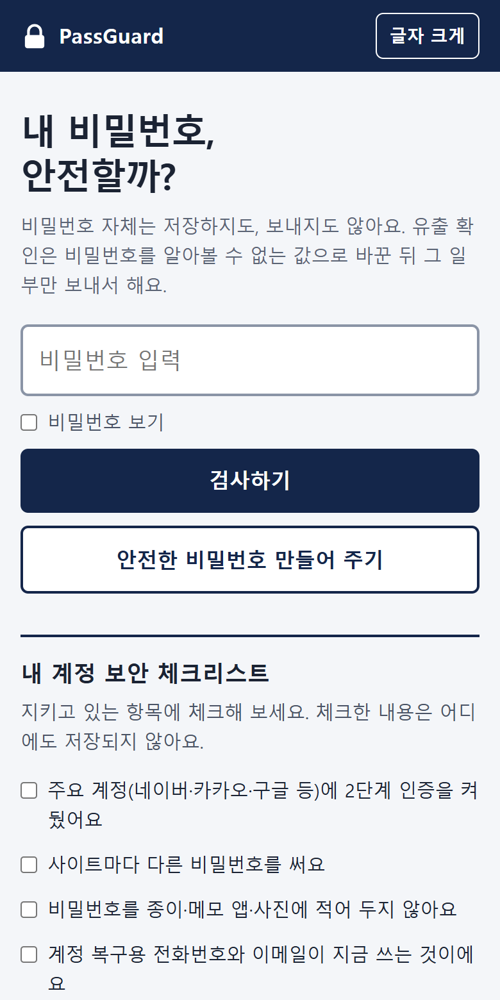
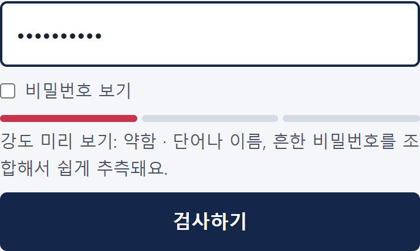
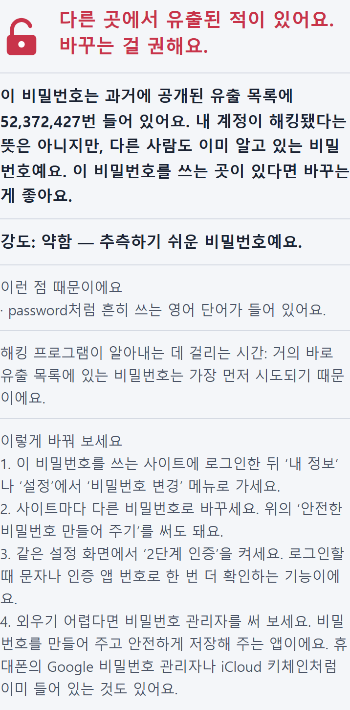
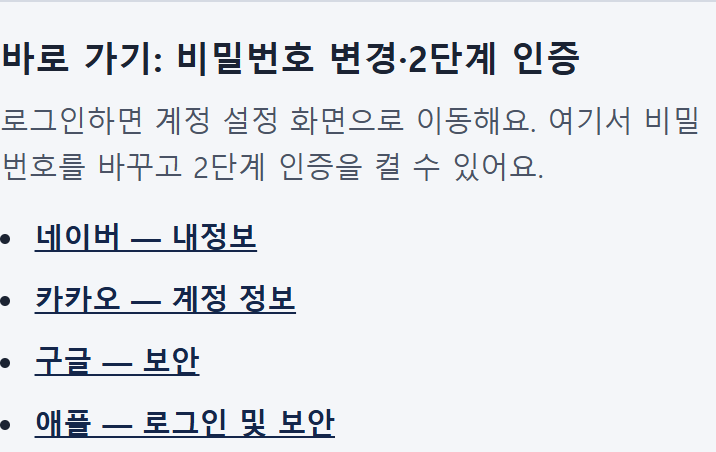
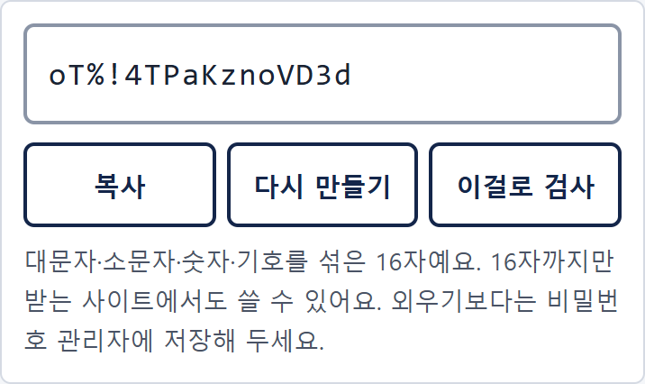
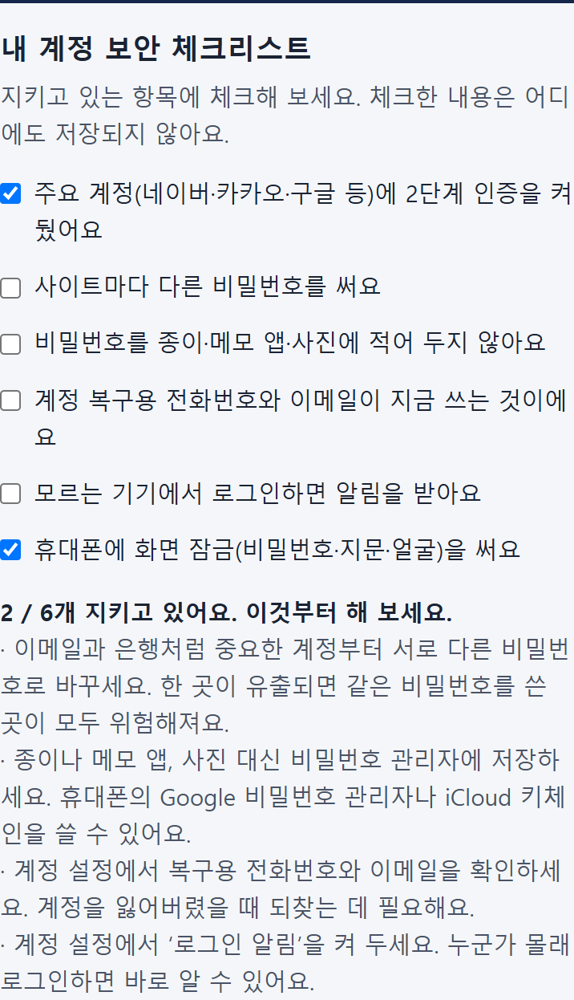
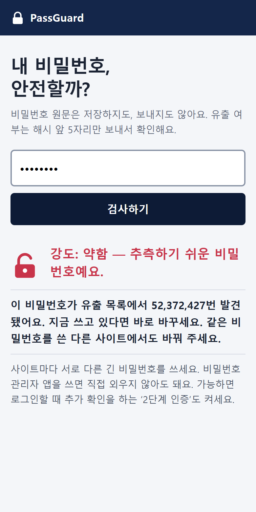
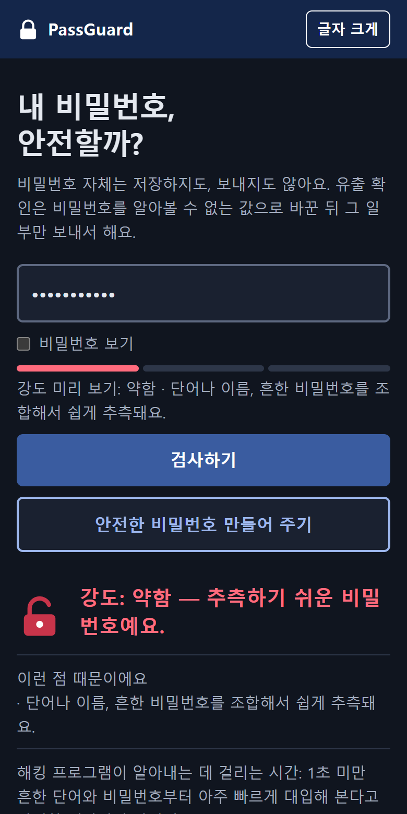
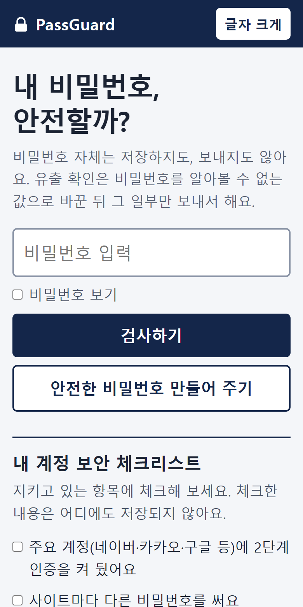

# PassGuard
### 내 비밀번호, 안전할까?

비밀번호 강도와 유출 여부를 확인하고, 어떻게 바꾸면 되는지 알려주는 웹앱

- 사용하기: https://whiteclover0542.github.io/PassGuard/
- 소스: https://github.com/whiteclover0542/PassGuard



---

## 1. 왜 만들었나

- 가족·친구는 비밀번호를 **생일, 이름, `qwer1234`** 처럼 만들고 여러 사이트에 같이 씀
- 유출 확인 사이트는 영어이고 보안 용어가 많아서 **결과를 봐도 뭘 해야 할지 모름**
- 그런데 비밀번호를 **아무 사이트에나 입력하는 것 자체가 위험**

> 목표: 보안을 모르는 사람도 **안심하고 입력하고**, 결과를 보면 **다음에 할 일을 아는** 앱

---

## 2. 무엇을 하나

| 기능 | 내용 |
|---|---|
| 강도 검사 | 약함·보통·강함과 **그 이유**, 입력하는 동안 미리 보기 |
| 추측 시간 | 해킹 프로그램이 알아내는 데 걸리는 대략적인 시간 |
| 유출 확인 | 공개 유출 목록에서 몇 번 발견됐는지 |
| 개선 안내 | 바꾸는 4단계 + 네이버·카카오·구글·애플 설정 바로 가기 |
| 비밀번호 만들기 | 대문자·소문자·숫자·기호를 섞은 16자 |
| 보안 체크리스트 | 6문항으로 내 계정 보안 습관 점검 |
| 접근성 | 큰 글씨 모드, 다크 모드 |

---

## 3. 시연: 입력하면서 바로 알려줌



- `Minsu1995!` → **약함**: 이름 + 연도 조합
- 한국 사용자에게 흔한 패턴을 따로 잡음
  - 영문 자판으로 친 한글: 안녕 → `dkssud`, 고양이 → `rhdiddl`
  - 생년월일, 전화번호, 흔한 이름의 로마자(`minsu`, `jiyoung`)

---

## 4. 시연: 유출된 비밀번호

 

- `password` → 유출 목록에 **5,237만 번**
- "해킹됐다는 뜻은 아니지만"으로 겁주지 않고, **바꾸는 방법과 바로 가기**까지 연결

---

## 5. 시연: 새 비밀번호 만들기 · 체크리스트

 

- 만든 비밀번호를 "이걸로 검사" → **강함, 1억 년 이상**
- 헷갈리는 글자(0 O 1 l I)는 빼고, 16자까지만 받는 사이트에서도 쓸 수 있게 16자로 만듦
- 체크리스트는 안 지킨 항목에 대해서만 할 일을 보여줌

---

## 6. 비밀번호를 보내지 않는 방법

```
내 브라우저                                     유출 확인 서버 (HIBP)
password
  └ SHA-1 → 5BAA6 1E4C9B93F3F0682250B6CF8331B7EE68FD8
               └ 앞 5자리 "5BAA6"만 보냄  ───────────▶  5BAA6로 시작하는 해시 목록 (약 2,000개)
  ◀──────────────────────────────────────────────  + 가짜 항목(Add-Padding)
  나머지 35자리는 브라우저 안에서 대조 → 52,372,427번
```

- 서버는 **어떤 비밀번호인지 알 수 없음** (k-익명성)
- 저장소·쿠키·콘솔에 비밀번호를 남기지 않음
- 브라우저 보안 정책(CSP)으로 **유출 확인 서버 외에는 연결 자체를 차단**

---

## 7. 사용자 의견으로 바뀐 것

<table><tr>
<td align="center"><b>1차 (의견 반영 전)</b><br></td>
<td align="center"><b>지금</b><br></td>
</tr></table>

| 사용자 의견 | 바꾼 것 |
|---|---|
| 뭘 해야 할지 막막하다 | 바꾸는 4단계 + 사이트별 바로 가기 |
| 2단계 인증, 비밀번호 관리자가 어렵다 | 쉬운 말 풀이와 예시 |
| 유출 문구가 무섭다 | "해킹됐다는 뜻은 아니지만", 권고형 제목 |
| "해시 앞 5자리 전송"이 헷갈린다 | "알아볼 수 없는 값으로 바꾼 뒤 일부만" |
| "컴퓨터로 추측하면"이 모호하다 | "해킹 프로그램이 알아내는 데 걸리는 시간" |

---

## 8. 추측 시간을 더 정확하게

| 비밀번호 | 처음 (길이 × 문자 종류) | 지금 (zxcvbn + 한국형 사전) |
|---|---|---|
| `correcthorsebatterystaple` | 1억 년 이상 | 약 8시간 |
| `Tiger7horse` | 약 8년 | 1초 미만 |
| `Minsu1995!` | 보통 | 약함 · 약 1분 |
| 무작위 16자 | 1억 년 이상 | 1억 년 이상 |

- 처음 계산은 단어를 이어 붙인 비밀번호를 **너무 강하게** 판정
- 사전 기반 라이브러리(zxcvbn) + 한국 이름·지명·흔한 비밀번호 50개를 추가
- 라이브러리도 저장소에 두어 외부 요청은 늘리지 않음

---

## 9. 어떻게 확인했나

- **완성 기준**을 먼저 정하고 전부 확인 (PLAN.md)
  - 기능: `password`, `123456` → 유출됨 / 무작위 20자 → 유출 없음, 강함
  - 보안: 외부 요청은 HIBP뿐, 요청에 원문·전체 해시 없음, 저장소·쿠키·콘솔 비어 있음
  - 사용성: 휴대폰 폭(375px)에서 가로 스크롤 없음, 사용자 검토 2회
- **자동 테스트**: 실제 Chrome으로 모든 기능을 눌러 보고 네트워크·저장소를 확인
- **셀프 체크**: `node check.js` (강도 판정, 한국형 패턴, 추측 시간, 비밀번호 만들기 200회)

 

---

## 10. AI와 나의 역할

| AI가 한 일 | 내가 판단한 일 |
|---|---|
| 코드 구현, 버그 수정 | 기획: 대상, 범위, 완성 기준 |
| 브라우저 자동 테스트 | 사용자 검토를 받고 의견 정리 |
| 문구 수정안, README | 넣을 기능과 뺄 기능 결정 |
| | 디자인 방향 ("너무 심플" ↔ "너무 튐") |
| | 바로 가기 링크를 내 계정으로 직접 확인 |

- 뺀 기능: 비밀번호 저장, 이메일 유출 확인, 입력 중 실시간 유출 조회
  → "아무것도 저장하지 않고, 요청은 버튼을 누를 때만"이라는 원칙과 맞지 않아서

---

## 11. 한계와 다음 단계

- **한계**
  - 추측 시간은 대략적인 값 (공격 방식과 사이트 저장 방식에 따라 다름)
  - 한국어 사전은 아직 작음 (영문 자판 한글 19개, 이름·흔한 비밀번호 50개)
  - 마지막에 추가한 기능은 실제 사용자 검토를 받지 못함
- **다음 단계**
  - 새 기능으로 사용자 의견 받기
  - 한국형 단어 사전 늘리기

### 감사합니다
https://whiteclover0542.github.io/PassGuard/
